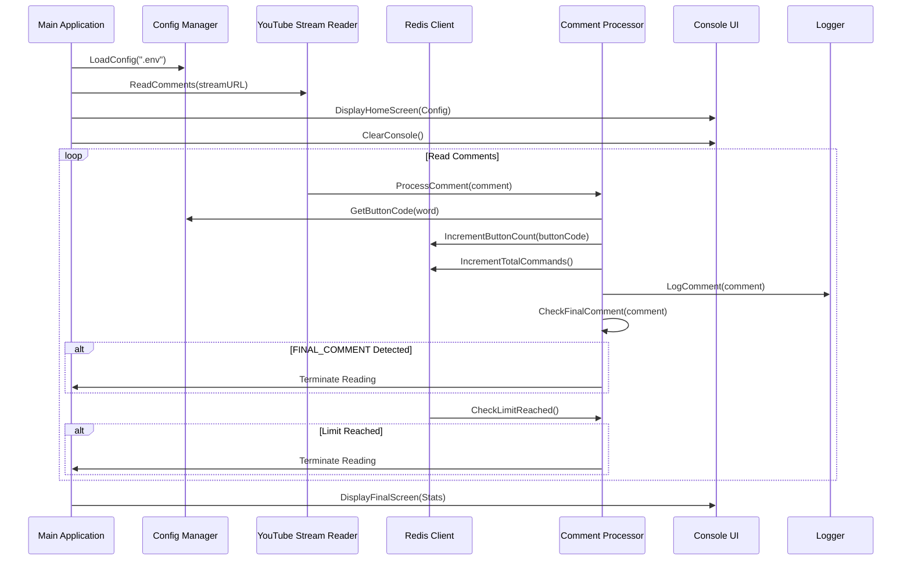
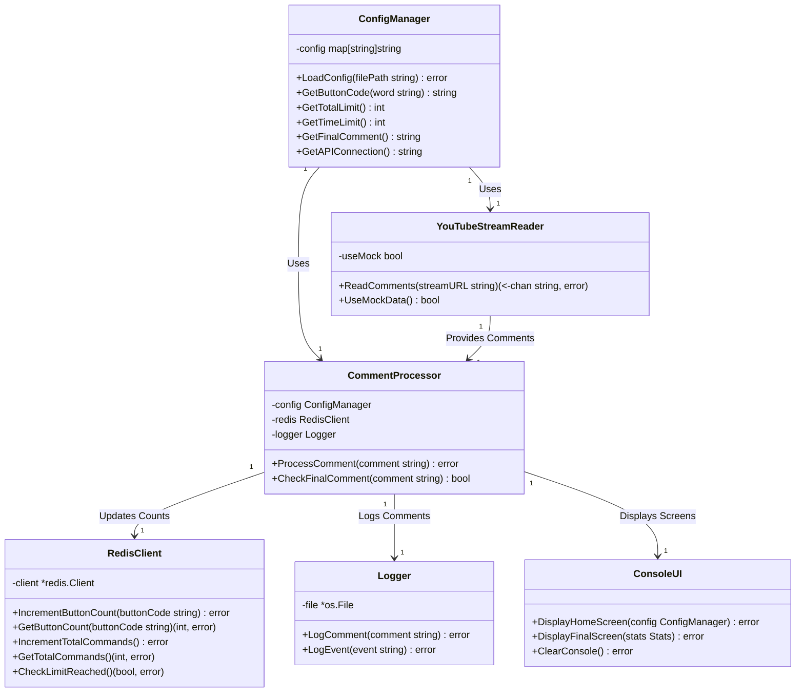

# Architecture Design: Golang Console Application

## Overview
This document outlines the architecture and system components for the Golang console application that reads comments from a YouTube stream, processes them based on a configuration file, and interacts with Redis to track button presses.

## System Components

### 1. Config Manager
**Responsibilities**:
- Load and parse the `.env` file.
- Provide configuration values to other components.

**Methods**:
- `LoadConfig(filePath string) error`: Load the configuration from the specified file.
- `GetButtonCode(word string) string`: Get the button code for a specific word.
- `GetTotalLimit() int`: Get the total limit on transmitted commands.
- `GetTimeLimit() int`: Get the time limit for completion.
- `GetFinalComment() string`: Get the FINAL_COMMENT configuration.
- `GetAPIConnection() string`: Get the API connection details.

### 2. YouTube Stream Reader
**Responsibilities**:
- Read comments from a YouTube stream.
- Support for both real API and mock data.

**Methods**:
- `ReadComments(streamURL string) (<-chan string, error)`: Read comments from the specified stream URL.
- `UseMockData() bool`: Check if mock data should be used.

### 3. Redis Client
**Responsibilities**:
- Interact with Redis to store and retrieve button counts.
- Track the total number of transmitted commands.

**Methods**:
- `IncrementButtonCount(buttonCode string) error`: Increment the count for a specific button.
- `GetButtonCount(buttonCode string) (int, error)`: Get the count for a specific button.
- `IncrementTotalCommands() error`: Increment the total number of transmitted commands.
- `GetTotalCommands() (int, error)`: Get the total number of transmitted commands.
- `CheckLimitReached() (bool, error)`: Check if the total limit on transmitted commands has been reached.

### 4. Comment Processor
**Responsibilities**:
- Process comments based on configuration.
- Update Redis with button counts.
- Check for FINAL_COMMENT.

**Methods**:
- `ProcessComment(comment string) error`: Process a single comment.
- `CheckFinalComment(comment string) bool`: Check if the comment contains the FINAL_COMMENT.

### 5. Console UI
**Responsibilities**:
- Display home screen and final statistics.
- Handle console cleaning.

**Methods**:
- `DisplayHomeScreen(config ConfigManager) error`: Display the home screen with buttons and parameters.
- `DisplayFinalScreen(stats Stats) error`: Display the final statistics screen.
- `ClearConsole() error`: Clear the console.

### 6. Logger
**Responsibilities**:
- Log comments and events.

**Methods**:
- `LogComment(comment string) error`: Log a comment.
- `LogEvent(event string) error`: Log an event.

## Data Flow

### Sequence Diagram

### Class Diagram

## Implementation Details

### Config Manager
- **File**: `config/config.go`
- **Dependencies**: None
- **Implementation**:
  - Use the `godotenv` package to load the `.env` file.
  - Parse and store configuration values in a map.

### YouTube Stream Reader
- **File**: `stream/stream.go`
- **Dependencies**: None
- **Implementation**:
  - Use the YouTube API client for real data.
  - Implement a mock data generator for testing.

### Redis Client
- **File**: `redis/redis.go`
- **Dependencies**: `github.com/go-redis/redis/v8`
- **Implementation**:
  - Initialize a Redis client with connection details from the config.
  - Implement methods to interact with Redis.

### Comment Processor
- **File**: `processor/processor.go`
- **Dependencies**: Config Manager, Redis Client, Logger
- **Implementation**:
  - Process comments to extract words and update button counts.
  - Check for FINAL_COMMENT and terminate reading if detected.

### Console UI
- **File**: `ui/ui.go`
- **Dependencies**: None
- **Implementation**:
  - Use the `fmt` package to display screens.
  - Implement console clearing functionality.

### Logger
- **File**: `logger/logger.go`
- **Dependencies**: None
- **Implementation**:
  - Log comments and events to a file.

## Testing Strategy

### Unit Tests
- **Config Manager**: Test loading and parsing the `.env` file.
- **YouTube Stream Reader**: Test reading comments from both real API and mock data.
- **Redis Client**: Test interacting with Redis.
- **Comment Processor**: Test processing comments and updating button counts.
- **Console UI**: Test displaying screens and clearing the console.
- **Logger**: Test logging comments and events.

### Integration Tests
- Test the interaction between components.
- Test the entire workflow from reading comments to displaying final statistics.

### End-to-End Tests
- Test the application with a real YouTube stream and Redis.
- Test the application with mock data and Redis.

## Conclusion
This architecture design provides a clear and structured approach to implementing the Golang console application. By following this design, we can ensure a modular and maintainable codebase.