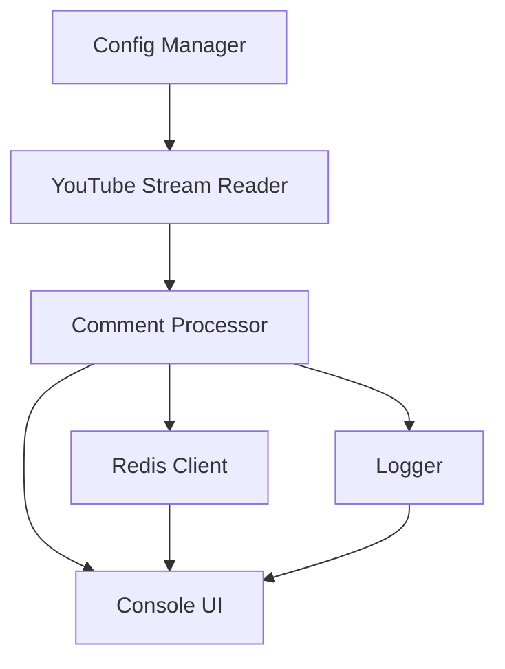

# Project Plan: Golang Console Application for YouTube Stream Comments

## Overview
This document outlines the plan for creating a Golang console application that reads comments from a YouTube stream, processes them based on a configuration file, and interacts with Redis to track button presses. The application will also display statistics and handle various edge cases.

## Requirements Analysis

### Core Features
1. **Configuration File**: Use a `.env` file to specify:
   - Button codes and their corresponding words.
   - Total limit on transmitted commands.
   - Time limit for completion.
   - FINAL_COMMENT to trigger early termination.
   - API connection details (real or mock).

2. **YouTube Stream Integration**:
   - Read comments from a YouTube stream.
   - Support for both real API and mock data.

3. **Redis Integration**:
   - Store button counts.
   - Track the total number of transmitted commands.

4. **Console UI**:
   - Home screen displaying buttons and parameters.
   - Final statistics screen.
   - Console cleaning functionality.

5. **Logging**:
   - Log all comments with timestamps.
   - Record events like FINAL_COMMENT detection.

6. **Testing**:
   - Auto tests for the application.

## Architecture Design

### Components
1. **Config Manager**:
   - Load and parse the `.env` file.
   - Provide configuration values to other components.

2. **YouTube Stream Reader**:
   - Interface for reading comments from YouTube.
   - Mock implementation for testing.

3. **Redis Client**:
   - Interface for interacting with Redis.
   - Methods to increment button counts and check limits.

4. **Comment Processor**:
   - Process comments based on configuration.
   - Update Redis with button counts.

5. **Console UI**:
   - Display home screen and final statistics.
   - Handle console cleaning.

6. **Logger**:
   - Log comments and events.

### Data Flow

## Implementation Steps

### Step 1: Create the example.env Config File
- Define button codes and their corresponding words.
- Set the total limit on transmitted commands.
- Specify the time limit for completion.
- Include the FINAL_COMMENT configuration.
- Add API connection details.

### Step 2: Implement the Main Application Logic
- Initialize the Config Manager.
- Set up the YouTube Stream Reader.
- Initialize the Redis Client.
- Start the Comment Processor.
- Display the home screen.

### Step 3: Add Redis Integration
- Implement methods to increment button counts.
- Check the total limit on transmitted commands.
- Store and retrieve button counts.

### Step 4: Implement the Home Screen and Final Statistics Screen
- Display buttons and parameters from the config.
- Show final statistics after reaching the limit or time.

### Step 5: Add Console Cleaning Functionality
- Clear the console on user input.
- Start reading comments from the stream.

### Step 6: Implement the FINAL_COMMENT Condition
- Check for the FINAL_COMMENT in comments.
- Terminate reading and display the final screen.
- Log the event.

### Step 7: Add Auto Tests
- Test the Config Manager.
- Test the YouTube Stream Reader.
- Test the Redis Client.
- Test the Comment Processor.
- Test the Console UI.

### Step 8: Update AGENTS.md with Project Instructions
- Add instructions for the AI Agent.
- Include setup and run commands.

### Step 9: Update the README.md with Run Command and Project Details
- Add the run command `./ycp`.
- Include project details and setup instructions.

## Timeline
- **Day 1**: Create the example.env config file and implement the main application logic.
- **Day 2**: Add Redis integration and implement the home screen and final statistics screen.
- **Day 3**: Add console cleaning functionality and implement the FINAL_COMMENT condition.
- **Day 4**: Add auto tests and update AGENTS.md and README.md.

## Dependencies
- Golang
- Redis
- YouTube API (optional, for real API integration)

## Risks and Mitigations
- **Risk**: YouTube API changes or unavailability.
  - **Mitigation**: Use mock data for testing and provide clear error messages.
- **Risk**: Redis connection issues.
  - **Mitigation**: Implement retry logic and provide clear error messages.
- **Risk**: Configuration errors.
  - **Mitigation**: Validate the configuration file and provide clear error messages.

## Conclusion
This plan outlines the steps and components required to build the Golang console application. By following this plan, we can ensure a structured and efficient development process.